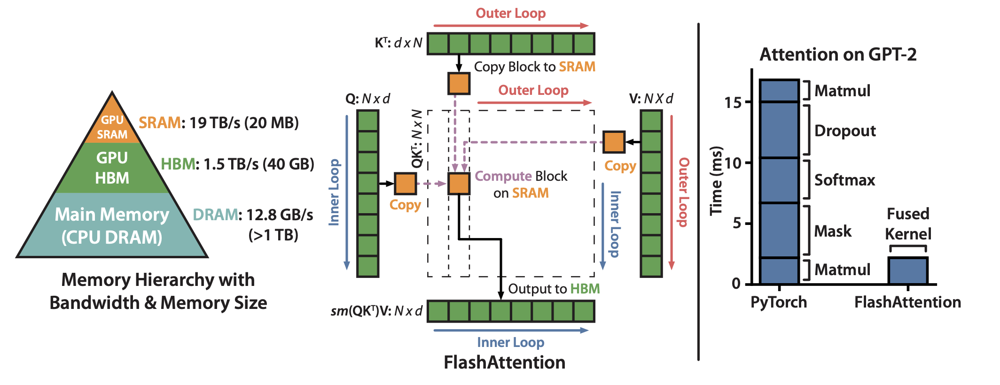
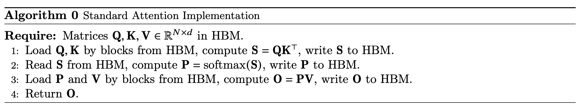
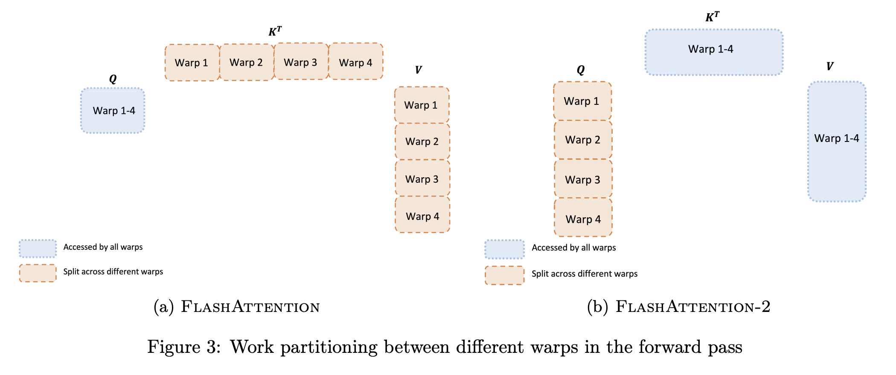

## Why FlashAttention?
FlashAttention optimization has essentially become a de facto standard for modern Large Language Model (LLM) training and inference. It consists of FlashAttention, released in 2022, and FlashAttention-2, released in 2023.

These two papers introduce numerous optimization techniques, with two being particularly noteworthy. They exemplify the classic approach of achieving performance acceleration by transforming algorithms through algebraic equivalence and leveraging the characteristics of GPU architecture. These optimization techniques are highly generalizable and warrant in-depth analysis.

In *FlashAttention: Fast and Memory-Efficient Exact Attention with IO-Awareness*, the authors utilize a technique called **Tiling**. This technique is common in computations involving massive datasets, such as Tile-based Rendering in mobile GPUs. In *FlashAttention-2: Faster Attention with Better Parallelism and Work Partitioning*, the authors adjust the algorithm based on the characteristics of the GPU's parallel execution architecture to reduce SRAM reads and writes, thereby achieving performance gains. The paper refers to this method as "work partitioning between warps."

> TBD: 

> 
> [FlashAttention 3](https://arxiv.org/pdf/2407.08608)
> 
> [FlashAttention 4](https://github.com/Dao-AILab/flash-attention/blob/main/flash_attn/cute/flash_fwd_sm100.py) - This is latest version released in Hot Chips 2025

**Neither of these optimization methods modifies the core Transformer algorithm.**

Instead, they leverage mathematical equivalence to restructure the computation process, making it better suited to the characteristics of modern computer architectures to gain advantages in performance and power consumption. Due to the enormous amount of data processed by Transformers, **reducing memory bandwidth usage** and the **number of memory accesses** (even to SRAM) can yield significant optimization effects. The fundamental reason Tiling and Warp Partitioning achieve performance gains is the reduction in memory access, which in turn improves overall performance.

## Tiling Optimization

Core Principle of the Optimization
1. Decompose the attention computation into **smaller blocks** (tiles), allowing the computation for each block to be completed within the GPU's high-speed cache (SRAM). This avoids creating and accessing large input and intermediate matrices in the relatively slow High Bandwidth Memory (HBM).

2. Fuse the multiple steps involved in attention computation (e.g., matrix multiplication, masking, Softmax, dropout) into a single GPU compute kernel. This prevents intermediate results from being repeatedly written to and read from HBM.

The following is the standard algorithm for computing attention scores. **The matrices Q, K, and V are extremely large**, with sequence lengths in mainstream models typically reaching the thousands.

Matrix multiplication itself can be processed in blocks, but the standard Softmax computation cannot, as it requires the complete input for normalization. To address this, FlashAttention introduces an **"online" Softmax algorithm** that can perform iterative calculations on blocks and ultimately produce a result identical to the standard Softmax. This demonstrates the use of mathematical equivalence (for detailed computation methods, see the original paper).

By solving the problem of block-wise Softmax computation, the input matrices Q, K, and V can be divided into blocks. During the attention calculation, the algorithm loads blocks of these matrices from HBM into SRAM for computation on a block-by-block basis. Due to the Memory Hierarchy, this directly avoids numerous accesses to HBM, allowing most memory operations to be completed in SRAM. Although HBM has very high bandwidth, it is still fundamentally DRAM, making its latency and power consumption incomparable to SRAM. Furthermore, techniques like prefetching can be used to further hide memory read latency. The prerequisite for all this is that the computation can be performed in a streaming fashion.

The following table intuitively shows the speed differences in memory access across different levels of the memory hierarchy.

| Memory Hierarchy         | Typical Access Latency         | Relative Energy Consumption |
|-------------------------|-------------------------------|----------------------------|
| CPU Register            | ~0.3 ns (1 clock cycle)       | ~1x (baseline)             |
| L1 Cache                | ~1 ns (about 3-4 cycles)      | ~5x                        |
| L2 Cache                | ~3 ns (about 10 cycles)       | ~10x                       |
| L3 Cache                | ~12 ns (about 40 cycles)      | ~20x                       |
| Main Memory (DRAM)      | ~100 ns (over 300 cycles)     | ~200x                      |

By using tiling (or blocking) techniques, data locality can be maximized, confining computation-intensive operations to the high-speed, small-capacity on-chip cache. This minimizes the number of accesses to the slow, large-capacity off-chip memory (HBM/DRAM). The performance gains from this approach essentially stem from reducing accesses to main memory, which in turn improves performance and power efficiency. When processing large-scale data, a key optimization direction, besides optimizing the computation itself, is to reduce memory operations.

The warp partitioning optimization in FlashAttention-2 is even more extreme, as it even reduces SRAM access operations, thus achieving further performance improvements. As seen in the table above, the fastest memory is the processor's internal registers; the access latency of L1, L2, or L3 caches is still significant in comparison.

Furthermore, fusing Transformer operations like matrix multiplication, masking, Softmax, and dropout into a single kernel allows all computations to be completed at once, improving GPU utilization. Otherwise, large intermediate results would need to be written to HBM, and new GPU kernels would have to be launched to read this data for subsequent calculations, causing unnecessary overhead.

### Tile-Based Rendering

This type of tiling optimization is common in the domain of embedded GPUs (e.g., Qualcomm Adreno, ARM Mali), where the primary optimization goals are power consumption and bandwidth.

Traditional Immediate Mode Rendering renders a scene object by object (polygon by polygon). In a complex 3D scene, the same pixel on the screen might be drawn multiple times by different objects (e.g., a chair in front of a sofa, which is in front of a wall). Each draw call requires reading and writing the pixel's color and depth information, leading to multiple accesses to the main video memory (VRAM), which consumes significant bandwidth and power.

Tile-Based Rendering, however, divides the screen into small rectangular "tiles" (e.g., 16x16 or 32x32 pixels). The rendering pipeline shifts from being "per-object" to "per-tile":

1. Geometry Processing (Binning): First, the GPU processes the geometry information (vertices) of all objects to determine which tiles each object covers.
2. Rasterization and Shading: The GPU then processes the scene tile by tile. For a given tile, it rasterizes, shades, depth-tests, and blends all object fragments covering that tile at once in a high-speed on-chip tile buffer.
3. Writeback to Main Memory: Only after all computations for a tile are complete is the final color result written back from the on-chip buffer to the framebuffer in main memory in a single operation.
  
Benefits:

- Extremely Low Bandwidth Usage: For occluded pixels, all computations and memory accesses (e.g., failed depth tests) occur only in the high-speed on-chip buffer and never touch main memory, saving a tremendous amount of bandwidth.
- Lower Power Consumption: Memory access is a major contributor to chip power consumption. Reducing main memory access naturally lowers power usage, which is critical for mobile devices.
- Higher Efficiency: Different tiles can be processed in parallel, and since the data is on-chip, access latency is extremely low.
  
Its core idea is identical to that of FlashAttention: use high-speed on-chip cache (SRAM) to avoid repeated reads from and writes to slower main memory (HBM/VRAM).

### Image Processing Pipelines

Another application is in image processing, where an operation (e.g., exposure, sharpening, denoising) is typically applied to an entire image. Executing multiple operations in series can cause severe performance issues.

A typical image processing flow might be RAW -> Denoise -> White Balance -> Sharpen -> JPEG. A naive implementation would generate and store a complete intermediate image in memory at each step. For a 4K resolution image, each step could require tens of megabytes of memory reads and writes, resulting in massive I/O overhead.

Modern Image Signal Processors (ISPs) and image processing languages like Halide adopt the concept of **Operator Fusion**. They do not compute full intermediate images. Instead, they "fuse" multiple processing steps together and perform calculations on a small tile or a single scanline of the output image at a time.

For example, to compute a 16x16 block of the output image, the system works backward to determine which region of data is needed from the "sharpen" step, which in turn determines the region needed from the "white balance" step, and so on. Ultimately, only a small, necessary portion of the original input is read. All intermediate results are kept in registers or on-chip cache without being written to main memory.

Benefits:

- Minimized Memory Access: Eliminates the storage and I/O of large intermediate images.
- Data Locality: All operations are performed intensively on a small chunk of data, leading to a very high cache hit rate.
- Parallelization: Different output tiles can be processed concurrently on different CPU cores or GPU thread blocks.
  
## Work Partitioning Between Warps

By adjusting how vectors are partitioned in matrix multiplication, intermediate results can be kept in registers as much as possible for direct use in subsequent calculations. This avoids the process of writing intermediate results to SRAM and then reading them back. This significantly reduces interaction with SRAM, thereby saving power and improving performance. In other words, if FlashAttention's main contribution was reducing HBM access, FlashAttention-2 goes a step further by reducing SRAM access through optimized work partitioning between warps.

To understand this optimization, one first needs to understand the basic execution unit structure of a modern GPU.

The core computational units on a GPU chip are called **Streaming Multiprocessors (SMs)**, and a single GPU is typically composed of multiple SMs. The Warp is the fundamental unit of hardware scheduling and execution on a GPU. An SM does not schedule tasks on a per-thread basis but rather in groups of threads called warps. On an NVIDIA GPU, a warp consists of 32 threads. The 32 threads in a warp execute the same instruction concurrently in hardware. A programmer cannot control individual threads within a warp. This is the hardware embodiment of the Single Instruction, Multiple Threads (SIMT) paradigm.

The following diagram is taken from the GPU chapter of *Computer Architecture: A Quantitative Approach, 6th Edition*.

*The mapping of a Grid (vectorizable loop), Thread Blocks (SIMD basic blocks), and threads of SIMD instructions to a vector-vector multiply, with each vector being 8192 elements long.*

*Simplified block diagram of a multithreaded SIMD Processor. It has 16 SIMD Lanes. The SIMD Thread Scheduler has, say, 64 independent threads of SIMD instructions that it schedules with a table of 64 program counters (PCs). Note that each lane has 1024 32-bit registers.*

*Scheduling of threads of SIMD instructions.The scheduler selects a ready thread of SIMD instructions and issues an instruction synchronously to all the SIMD Lanes executing the SIMD Thread. Because threads of SIMD instructions are indepen- dent, the scheduler may select a different SIMD Thread each time.*

The "SIMD Thread" mentioned in Figure 4.13 corresponds to the concept of a warp in GPU programming. Therefore, the warp is the physical fundamental unit for instruction execution in a GPU. Each warp has its own register file and can access the shared memory within its thread block, which is typically implemented with SRAM.

Returning to the optimization in FlashAttention-2, we need to re-examine the core attention computation algorithm.

$$
S = Q \times K^T
$$
$$
O = \text{softmax}(S) \times V
$$
The change discussed in Figure 3 of the paper occurs entirely within the computation of the first step, $S = Q \times K^T$. To understand this, we need to review the specifics of matrix multiplication.

For $S = Q \times K^T$, any element $s_{ij}$ (at row i, column j) in the matrix $S$ is obtained by the dot product of the i-th row of matrix Q and the j-th row of matrix K.

$$s_{ij} = \text{dot\_product}(Q_{\text{row}_i}, K_{\text{row}_j}) = \sum_{d=1}^{d_k} q_{id} \cdot k_{jd}$$

Since the Q and K matrices are very large, they cannot be fully stored in SRAM, let alone in the limited registers within a warp. Therefore, the large matrices must be processed in blocks. The partitioning strategy can be along the dimension of the K matrix (Split-K) or along the dimension of the Q matrix (Split-Q). FlashAttention uses the Split-K approach, whereas FlashAttention-2 switches to Split-Q, which can effectively reduce SRAM access.

It is worth noting that partitioning along either dimension is mathematically equivalent, thanks to the decomposability of matrix multiplication. The key difference lies in the performance when the algorithm is mapped onto specific hardware for execution.

#### Reasoning Process

**1. Splitting K (Split-K, as implemented in FlashAttention)**

- Q: Shared. All warps computing $s_{ij}$ can access the complete i-th row of matrix Q.
- K: Split by column (along dimension d). Assume each row of the K matrix is split into two halves:
  - Warp 1 has the first half of the j-th row of K: $(k_{j1}, ..., k_{j,d/2})$.
  - Warp 2 has the second half of the j-th row of K: $(k_{j,d/2+1}, ..., k_{jd})$.
    
Now, to compute $s_{ij}$:

$$s_{ij} = \underbrace{(q_{i1}k_{j1} + ... + q_{i,d/2}k_{j,d/2})}_{\text{partial\_sum\_1}} + \underbrace{(q_{i,d/2+1}k_{j,d/2+1} + ... + q_{id}k_{jd})}_{\text{partial\_sum\_2}}$$

- Warp 1: Can only compute **partial_sum_1**.
- Warp 2: Can only compute **partial_sum_2**.
  
No single warp can independently obtain the final result for $s_{ij}$. To get the final value, they must communicate: each warp writes its calculated partial sum to shared memory (SRAM), and then one warp reads these values to perform the summation. In the Split-K scheme, the task of computing a single output element $s_{ij}$ is split among multiple warps, creating computational dependencies and communication overhead between them.

**2. Splitting Q (Split-Q, as implemented in FlashAttention-2)**

- Q: Split by row (along sequence length N).
  - Warp 1 has the first half of the rows of Q (e.g., rows 1 to 16).
  - Warp 2 has the second half of the rows of Q (e.g., rows 17 to 32).
- K: Shared. Any warp can access the complete K matrix.

Now, let's compute $s_{ij}$, assuming i is within the range managed by Warp 1 (e.g., i=5):

- Computing $s_{ij}$ requires the i-th row of Q and the j-th row of K.
- Warp 1: Possesses all the data needed to compute $s_{ij}$ (the i-th row of Q and the complete j-th row of K). Therefore, it can independently and completely calculate the entire dot product: $s_{ij} = \sum q_{id} \cdot k_{jd}$.
- Warp 2: Cannot participate in the computation of $s_{ij}$ because it does not have the data for the i-th row of Q.
  
In the Split-Q scheme, the task of computing any given row of the output matrix S (e.g., the i-th row) is entirely assigned to the single warp that owns the i-th row of Q. Thus, the work of each warp is naturally divided by "output row," making their computations completely independent and free of interference, eliminating the need for inter-warp communication via SRAM for intermediate results.

When the computational load is large, this cross-warp reduction operation becomes a performance bottleneck because it introduces extra shared memory reads/writes and synchronization overhead.

## Conclusion
In the context of not altering the underlying mathematical principles of an algorithm, achieving algorithm-hardware co-design through a deep understanding of computer architecture (especially the memory hierarchy) is a common paradigm for attaining peak performance. 

To perform deep performance optimization, one must first have a thorough understanding of the underlying hardware architecture and adjust the algorithm's implementation accordingly. Finding mathematically equivalent transformations that allow the algorithm's implementation to better match the hardware's characteristics is undoubtedly the ideal optimization path. 

Furthermore, in scenarios where precision requirements are less strict, one can leverage the intrinsic properties of data (such as sparsity) to perform approximate computing for even greater performance gains.